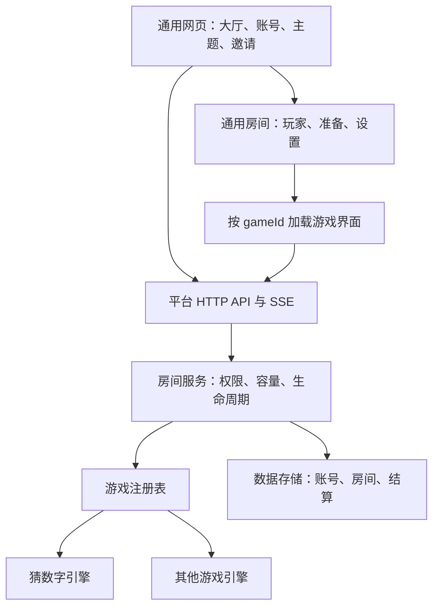

# 多游戏大厅：架构复查与扩展设计

更新：2026-10-04。本文区分当前实现与目标设计；下面的目录、接口和数据库变更尚未实现。

## 结论与适用范围

现有 Node.js + SQLite + SSE 可以继续承载好友自用的多个房间、多个游戏。账号、会话、大厅、在线状态、邀请、日夜主题和手机布局可以共用。但目前房间引擎与猜数字规则混在 `Duel` 中，服务端和前端也直接调用猜数字逻辑，尚未达到注册一个游戏模块就能接入的程度。

平台需要同时支持两种生命周期：`match` 对局型（猜数字、打牌、下棋）与 `persistent` 长期型（农场、牧场、养成）。对局型在独立房间内开局和结算，各游戏规定人数、配置、玩法、胜负与复盘；长期型保存玩家的持续进度，离线、退出界面或服务器重启都不清空存档。

一名用户目前仍只能参加一个房间；目标中此限制只针对对局房间，不限制长期游戏存档。邀请所有在线空闲玩家，不加入好友关系机制。低频养成游戏的时间推进与长期数据设计见 [长期养成游戏架构](persistent-game-architecture.md)。高频动作游戏需要另行验证同步协议和性能。

目标技术选型已补充为 Vue 3 + TypeScript + Vite 前端、Node.js + Fastify + TypeScript 后端，以及接入正式长期游戏前迁移至 PostgreSQL。当前线上仍使用原生 JS 与 SQLite。选型理由、最终仓库布局和迁移步骤见 [技术选型](technology-decisions.md)；下文目录仅用于表达模块边界。

## 已有能力与实际耦合

| 部分 | 现状 | 扩展需要 |
| --- | --- | --- |
| 账号和会话 | 独立账号，多个用户同时在线 | 各游戏共用，保留现有账号 |
| 大厅目录 | `/api/catalog` 返回数组，有 `gameId` 和人数元数据 | 建立真正的游戏注册表，卡片文案、封面、玩法、设置由各游戏提供 |
| 房间创建和恢复 | `server.mjs` 两处直接 `new Duel(...)` | 按 `gameId` 和规则版本选择引擎 |
| 容量和准备 | `Duel.join/prepare` 固定双人；邀请也要求房间只有一人 | 平台按游戏声明的容量校验，支持多人邀请与准备 |
| 游戏动作 | `/room/secret`、`dice`、`guess` 直接调用猜数字 | 平台统一转发动作，插件验证自己的操作 |
| 离开和断线 | 双人退出就判另一人获胜，统一暂停 60 秒 | 等待阶段用通用房间策略，进行中由游戏规定弃权、替补、暂停或继续 |
| 结算 | 直接使用 `room.history`、单个 `winner`、`guessed` 原因 | 引擎输出通用结算，支持平局、团队、多获胜者和分数 |
| 数据库 | `results` 未记录游戏类型；快照缺少明确版本 | 增加游戏、规则和快照版本，历史结果能够区分游戏 |
| 前端 | `roomPage`、玩法弹窗、封面、动作和动画写死猜数字 | 平台框架与各游戏独立界面分开 |
| 同步 | 状态变动广播整个大厅，快照整表重写 | 少量好友可用；扩展时把大厅事件与房间事件分开，仅更新变更房间 |
| 复盘 | 结束后双方可查看当前房间完整记录；重开或离开后不提供旧局查询 | 各游戏定义复盘内容；若开放历史复盘，单独持久化并校验参与者权限 |

依据：`server.mjs` 的 `state/completed/leave`、房间创建和快照恢复；`game.mjs` 的 `Duel`；`public/app.js` 的 `lobby/rules/roomPage` 和动作处理。

## 平台与游戏的边界



平台拥有：账号认证、在线用户、房间编号、房主和席位、邀请有效期、准备状态、加入权限、动作调度、同步连接、持久化，以及按玩家筛选后的消息分发。

游戏拥有：人数范围、配置校验、开局条件、内部阶段、可执行动作、计时规则、随机规则、每人可见内容、结束条件、分数和复盘。猜数字的“锁定数字 → 掷骰 → 轮流猜”、30 秒与禁用历史都是这个游戏的配置，不能成为所有游戏的必选设置。

平台不读取引擎的 `secrets/history/dice` 等内部字段，不假设每个游戏只有一个赢家。游戏界面不创建自己的账号体系或另一个大厅。

## 建议目录

```text
server.mjs                  HTTP 入口与静态资源
platform/
  auth.mjs                  账号、会话
  lobby.mjs                 在线状态、邀请、目录
  rooms.mjs                 房间生命周期、动作调度
  store.mjs                 数据存储与事务
  migrations.mjs            数据库和旧快照迁移
games/
  registry.mjs              gameId -> 游戏定义
  guess-number/
    definition.mjs          元数据、配置 schema、工厂
    engine.mjs              猜数字规则、私人视图、结算
public/
  app.js                    平台界面、连接管理
  theme.js                  日夜主题
  games/
    registry.js             gameId -> 界面模块
    guess-number.js         猜数字界面与动画
test/
  platform.test.mjs          通用房间与邀请
  registry.test.mjs          接入契约、快照恢复
  guess-number.test.mjs      游戏规则和隐私
docs/
  multi-game-architecture.md
```

引擎不绑定 HTTP、DOM 或数据库，时间和随机数通过上下文传入，便于确定性测试。浏览器模块由明确的资源清单提供，不把请求路径直接拼到磁盘路径。

## 对局型游戏定义与引擎契约

以下是对局型目标接口示意，不是目前可直接调用的导出。所有游戏共享 `id/version/kind/metadata` 注册信息，长期型使用独立的档案、时间结算与事务动作接口，不要求提供开局或胜负方法：

```js
const definition = {
  id: 'guess-number',
  version: 1,
  kind: 'match',
  metadata: {
    name: '猜数字', category: '推理',
    minPlayers: 2, maxPlayers: 2,
    description: '藏好四位数字，轮流推理。',
    rules: ['两人准备后设置数字', '只计算相同位置的命中数'],
    defaultSettings: { turnSeconds: 30, disableHistory: false },
    settingsSchema: {/* 可选时间、布尔项等可公开配置 */}
  },
  validateSettings(settings) {},
  create({ players, settings, now, random }) {},
  restore({ snapshot, version, now, random }) {}
};

// create/restore 返回的引擎
engine.start();
engine.handleAction({ playerId, type, payload });
engine.tick(now);
engine.onPresence({ playerId, online, now });
engine.onLeave(playerId);
engine.viewFor(playerId);     // 该玩家可见状态，不能返回内部快照
engine.serialize();           // 完整服务器快照，仅服务端持久化
engine.result();              // 未结束时返回 null
```

结算示意：

```js
{
  status: 'finished', reason: 'completed',
  participants: [
    { userId: 'a', outcome: 'win', score: null },
    { userId: 'b', outcome: 'loss', score: null }
  ],
  review: { type: 'guess-number', version: 1, records: [] }
}
```

平局时双方 `draw`，团队获胜时允许多个 `win`；平台根据参与者的 outcome 统计胜场。复盘内容由对应游戏界面解释，不要求五子棋、牌类游戏也返回“四位数字命中数”。

插件按明确列表注册，不允许浏览器提交模块路径或上传任意游戏代码。

## 房间生命周期与多人规则

通用房间状态只使用 `waiting / in_progress / finished`。猜数字的 `secrets / dice / playing` 放在游戏内部阶段，其他游戏无需伪装成这些阶段。

1. 选择游戏创建房间，配置取自游戏定义并由服务器校验。
2. 等待阶段允许邀请至 `maxPlayers`，人数达到 `minPlayers` 且所有已入座玩家准备后开始。若某游戏必须满员，游戏另行声明开局条件。
3. 修改配置或席位变化清除准备状态，所有人看到同一版设置后重新准备。
4. 接受邀请再次检查有效期、空位和玩家是否空闲；邀请不占席位，不能因同时接受超出容量。开局、满员、关闭房间后失效的邀请及时撤销。
5. 进行中默认禁止新玩家入座，未来有明确需求时再增加观战或中途加入策略。
6. 等待阶段成员离开不产生胜负，房主离开可移交给最早入座的成员；空房间销毁。进行中交给游戏自己的离开策略。
7. 重开生成新的 `matchId`，清空引擎内容、骰子、秘密与回合记录，保留房间、席位和已校验配置。

同一大厅中可以有一个双人猜数字房间、另一个双人棋盘房间和一个多人游戏房间；房间状态、设置、时间和动作相互独立。

## 动作、同步与隐私

保留通用创建、加入、准备、设置、邀请、离开与重开接口。游戏动作使用统一入口，例如：

```text
POST /api/rooms/:code/actions
{ matchId, requestId, expectedRevision, type, payload }
```

玩家身份来自服务器会话，不能信任 payload 中自称的用户。平台检查成员资格、对局编号与状态版本后调用对应引擎；引擎检查回合、游戏阶段和动作内容。重复 requestId 返回原结果，旧 matchId 的请求不能影响新一局。每个房间按顺序处理动作，配置变更与开局也进入同一调度链。

SSE 继续服务回合制游戏：大厅发送在线列表和游戏状态摘要，房间事件只发给参与者。广播前分别调用每个玩家的 `viewFor`，禁止把包含隐藏信息的同一份引擎快照广播给所有人。HTTP 响应、SSE、恢复和复盘接口使用同一套可见性规则。

记忆模式进行中不发送完整历史；结束后由游戏释放允许公开的复盘。随机结果、截止时间和胜负由服务器决定。断线政策由游戏声明，平台负责检测在线变化和重连；系统重启恢复时按保存的剩余时间与策略处理，不擅自替游戏判胜。

房间 revision 只在有效变更时递增。持久化只写变更房间，结算每个 matchId 写一次。高频游戏若需要其他传输协议，可通过平台的传输接口接入，但不先为尚未添加的游戏引入额外服务。

## 前端接入

大厅卡片、人数描述、玩法说明、默认设置和控件由元数据驱动；例如人数显示 `2 人` 或 `3–8 人`。目录只有真正已接入且启用的游戏。

房间外框共用玩家、准备、邀请、退出、主题与连接状态。进入游戏后按 `gameId` 挂载界面模块；模块提供 `mount/update/unmount`，通过平台 action 客户端发送动作。手机和电脑使用同一规则状态，不依赖设备类型决定回合。

尽量更新已有 DOM 节点，避免每条 SSE 消息重建整页。草稿、输入焦点、软键盘位置、历史滚动与减少动态效果设置都属于游戏界面接入验收。主题用共享 CSS 变量，新增游戏必须同时完成日间、夜间和手机布局。

## 数据存储与兼容迁移

当前 SQLite 保存线上数据；结合长期游戏计划，目标数据库统一为 PostgreSQL，在正式长期存档产生前完成受控迁移。游戏仍共用一个数据服务，`users/sessions` 不因每个游戏另建账号体系。下面是逻辑表结构的演进，迁移须保留旧 ID、关联和快照。

- `results` 增加 `game_id`、`game_version`、`match_id`、`settings_json` 与版本化 `review_json`；`match_id` 唯一，防止重复结算。
- `result_players` 增加 `outcome` 和可空 `score`；已有单 winner 字段在兼容期保留。
- `active_rooms.snapshot` 使用明确外壳：`snapshotVersion / gameId / gameVersion / matchId / revision / members / settings / engine / savedAt`。秘密只出现在服务端快照中。
- 旧结果回填 `guess-number`，根据原 winner 回填 outcome；旧快照由专用迁移器映射至猜数字引擎。不能用新类直接覆盖任意旧版本字段。
- 老结果没有保存完整猜测过程，迁移不能凭空补出历史复盘；必须展示“该旧对局未保存复盘”。
- 如果开放过往复盘，接口按 `result_players` 校验当前用户是否参与，再返回对应游戏允许公开的内容。

迁移采用事务、新增字段和版本编号，先备份实际数据库，再验证旧账号、已结束房间和进行中的对局均能恢复。未知规则版本需要明确错误与恢复方案，不静默换成另一个游戏。已经完成的游戏版本在仍有活动快照时保留恢复能力。

## 实施顺序与验收

第一步：建立注册表与引擎适配层，将猜数字接入；前后端暂时兼容当前接口和快照。验收现有 11 项测试，并补充旧快照迁移、注册失败和按游戏恢复测试。

第二步：抽出通用房间和独立前端模块，取消平台层的双人、猜数字阶段和字段假设。使用测试专用的三人引擎验证容量、邀请、准备和多人离开策略；测试引擎不进入正式游戏目录。

第三步：增加数据库版本迁移和按游戏结算，再接入第二个正式游戏。新增内容应集中在一个后端模块、一个前端模块和注册项，平台服务不新增该游戏专属的 switch 分支。

若接下来的正式游戏选择农场或牧场，则在共用注册表、认证、目录和界面分发建立后，增加长期档案服务与持久化动作事务，按长期养成设计验收；不要将农场存档装进 `active_rooms` 或依赖房间准备流程。

最终必须验证：不同游戏同时运行不串房；2 人和多人容量正确；同名动作在不同游戏由自己的引擎解释；HTTP/SSE 均不泄露私人信息；重启恢复选择正确游戏与版本；不同设备可以互玩；复盘、平局、团队结算可由各自模块处理。

当前设计交付不等同于完成这些重构。添加第二个游戏前，应先落地注册表、房间边界与界面分发，再用第二个游戏检验接口是否足够通用。
