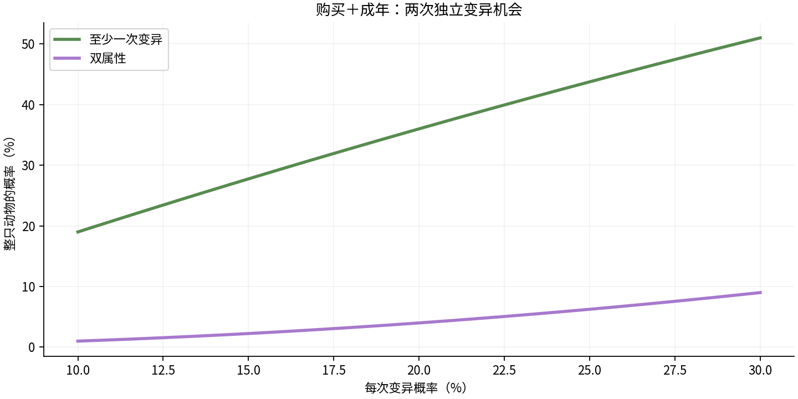
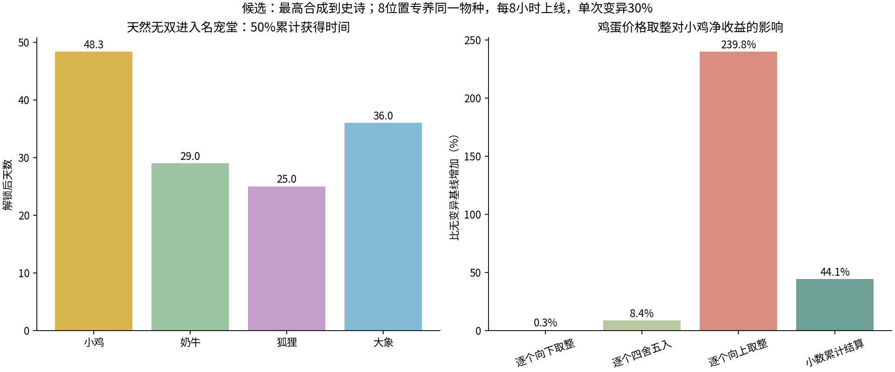

# 一起牧场：变异与名宠堂合成数值模拟

日期：2026-10-05（Asia/Shanghai）。状态：只读数值实验与推荐稿，未实现、未迁移、未发布。

## 结论与本次范围

建议采用最新提出的“最高合成到史诗”，传奇、无双仅自然变异获得且不作为合成材料。普通两只→优秀；优秀两只→史诗；史诗停止升阶。本轮将其作为推荐候选，覆盖此前可逐级合成至无双的方案；用户尚未确认本报告新提出的具体概率、费用与材料来源。

保留购买、成年各一次10%起步、图鉴成长后单次最高30%；第二次成功抽不同属性；最多双属性；无照顾升品质；退休合成不恢复生产，不追溯改仓库产物。允许持续刷小鸡，收益和图鉴结构形成选择。

采用三项共同约束：品质权重按完整养殖周期分档、加价按小数累计结算、品质不增加经验/轮次/产量/生产速度。否则短周期的抽取次数与整数售价放大会绕过合成成本。

完成21组各100万次抽样（共2100万），4组各1万条首批合成材料样本，31条90天真实纯引擎轨迹；36物种的经验、收入、饲料、完成停粮逐一核对；零变异对照与冻结原引擎模拟完全一致。31轨迹是策略样本，不足以当作真人到达时间分布。

## 输入与可重复性

冻结开发规则版本3，源Git HEAD `15450a3ac064f3089e5c351a4a1f12a3b073304b`。读取时有其他Agent未提交的生命周期代码，本实验把实际读取的8个依赖文件连同SHA-256冻结在source目录；HEAD本身不能完整代表输入。

36种配置来自ranch-catalog.ts，不改现有价格/成长/轮次/经验。初始800金币、240饲料、4位置，赠送成年小鸡保持现状、不补历史变异；每只有效成长/生产每小时2份饲料，满存/完成暂停；仅收获给经验。名宠堂路线没有出售动物的15%返还。

输入：`input.json`；精确概率/抽样/收益：`analysis-results.json`；真实引擎轨迹：`trajectory-results.json`；候选配置：`candidate-config.json`。CSV包含36物种全表。随机种子20261005，轨迹额外使用20261006、20261007。所有运行在京东云，不访问数据库、真实账号或网络游戏接口。

复现（路径为云端）：

```sh
python3 /opt/pair-play-dev/artifacts/mutation-balance-20261005/analyze.py --root /opt/pair-play-dev/artifacts/mutation-balance-20261005
/opt/pair-play-dev/node_modules/.bin/tsx /opt/pair-play-dev/artifacts/mutation-balance-20261005/source/scripts/mutation-trajectory.ts /opt/pair-play-dev/artifacts/mutation-balance-20261005
/opt/pair-play-dev/artifacts/mutation-balance-20261005/venv/bin/python /opt/pair-play-dev/artifacts/mutation-balance-20261005/report.py --root /opt/pair-play-dev/artifacts/mutation-balance-20261005
```

分析依赖numpy；绘图使用隔离venv中的matplotlib，未改变应用依赖。永久资料副本在docs/simulations/ranch-mutation-20261005。运行永久副本时把该目录作为--root，tsx仍由项目node_modules提供；report.py需要同一绘图库环境。

## 两次变异概率

|单次概率|无变异|单属性|双属性|至少一次变异|
|---:|---:|---:|---:|---:|
|10%|81%|18%|1%|19%|
|20%|64%|32%|4%|36%|
|30%|49%|42%|9%|51%|

若购买和成年用不同概率p1、p2，至少一次=1−(1−p1)(1−p2)，双属性=p1×p2。本轨迹候选按每个事件当时的图鉴加成判定，按事件顺序更新已发现组合；批量/离线事件排序还需实际实施验收。重试不得再次抽取。



## 推荐品质权重：仅在一次变异成功后抽取

普通未变异动物保持普通。每次成功抽属性和品质，成年品质取两次较高者，失败不退化。这些是实验假设/推荐，用户只冻结了总体变异率与两次机会，不能误写成已批准的权重。

|完整生涯T|对应示例|普通|优秀|史诗|传奇|无双|
|---|---|---:|---:|---:|---:|---:|
|≤2小时|小鸡、兔|40%|42%|15%|2.9%|0.1%|
|>2至24小时|羊、奶牛|36%|42%|17%|4.5%|0.5%|
|>24至72小时|狐狸、羊驼|32%|42%|18%|7%|1%|
|>72小时|水牛、狮子、大象|28%|40%|20%|8%|4%|

T=(成长时间+有限轮次×生产周期)，不是仅看等级或单轮时长。每个物种所属档固定在配置版本中，购买时快照，不能用用户离线/饥饿拖长时间来提高品质概率。档位边界2/24/72小时需随着新物种复核；不追溯调整老个体。

统一0.02%条件无双权重在“不可合成无双”下不可用：30%单次变异时整只无双率约0.012%，8位置大象不断养殖，50%获得时间约6507天（完成入堂口径）。按长周期提高权重后为36天。稀有目标仍有随机长尾，未加入额外第三次机会或保底。

## 属性与双属性

候选权重：雷25%、火25%、水25%、黄金15%、梦幻10%。第二次成功排除已有属性后按剩余权重归一；不是五种等概率，也不重抽已有属性。合成随机确实从完整属性池抽一个；双属性保留一个、重抽另一个，排除保留属性，允许抽回被替换属性，不保证每次新发现。

传奇、无双停止合成，也不能借合成洗属性。史诗封顶后暂不增加“史诗+史诗洗属性”配方；不引入循环无损重抽。双属性结果需要至少一只双属性来源。两只无属性合成可额外支付重抽成本生成单属性，这会增加图鉴发现，收益概率加成必须按唯一物种+无序组合计数。

## 产物价格与收益

候选品质加成：普通0%、优秀10%、史诗25%、传奇50%、无双100%。雷/火/水各5%，黄金10%，梦幻15%；双属性相加、属性总加成最多20%。

`价格=基价×(1+品质加成+min(20%,属性加成之和))`，最高2.2倍。成长/轮次/数量/饲料/经验保持基线。已有产物批次快照固定，名宠堂合成只影响收藏。

|周期档|10%单次时平均销售收入增加|30%单次时平均销售收入增加|
|---|---:|---:|
|short|3.21%|9.39%|
|medium|3.54%|10.34%|
|long|3.93%|11.46%|
|slow|4.68%|13.61%|

以上是销售收入，净利润因原始薄利会放大，不能混用。小鸡基线完整生涯18金币收入−13认养−1.1667饲料=3.8333净利润；30%单次、新短周期方案平均净利润约5.5232（+44.08%），不是产量增加44%。旧高加成草案在同样30%单次下小鸡净利润提高约131%，不推荐。

严禁逐个向上取整：小鸡30%单次时，均价从理想1.0939变为1.5106，净利润提高239.76%。逐个向下取整则几乎抹掉变异收益。建议千分金币整数报价，钱包累计余数；交易时整金币入账，剩余小数保留。同样数量拆成多次出售必须收入/余数完全一致。该价格机制只是模拟层覆盖，当前游戏还没有实现。

## 合成材料与费用候选

|配方|品质结果|材料|金币费用|
|---|---|---:|---:|
|普通×2|优秀|0|ceil(该物种认养价×10%)|
|优秀×2|史诗|3枚融合晶露|ceil(该物种认养价×25%)|
|史诗×2|禁止升级|—|—|
|传奇/无双参与合成|禁止|—|—|

随机属性重抽建议额外消耗：合成优秀1枚、合成史诗2枚晶露。费用用于真正重新抽属性，指定继承现有组合不收重抽材料。4只普通小鸡完整合成史诗，指定路线费用2×2+4=8金币、3枚晶露；每一步都重抽则总7枚晶露。这两个重抽附加成本尚未纳入实际轨迹，不应报告已全面模拟通过。

材料候选来源：结算真实生产后领取，每个个体每个真实产出日最多1枚，整个账号每个产出日最多3枚，同物种也可以。不是每天必须手动点三次；离线产出按真实批次日期记账、在实际收获事务里发放，不能刷新补领。晶露在购买/赠送/合成不发放；新手赠送批次round0不发，后续正常生产可发。与旧的“每物种一天一枚”比较，按个体发放更符合允许刷小鸡的决定。

最高史诗后，低档重复仍用于收集属性、不同物种最高品质和自选外观。晶露不影响天然传奇、无双概率。首版无主动返生产、无限洗属性、付费充值资源或合成失败。

## 稀有品质时间：条件模拟，不能当保证日期

下表是假设已解锁且有资金、8位置全部养同一物种、每8小时回访、两次概率始终30%，统计至少一只自然无双完成生产进入名宠堂。50%是中位累计获得概率、90%仍不是保底；变异本身会在购买/成年更早揭晓。新玩家从10%起步、还需要解锁与资金，所以不能直接把本表当注册后时间。

|物种|整只自然无双概率|50%获得的累计个体数|50%入堂天数|90%入堂天数|
|---|---:|---:|---:|---:|
|小鸡|0.0600%|1156|48.3|160.0|
|奶牛|0.2998%|231|29.0|96.0|
|小狐狸|0.5991%|116|25.0|80.0|
|大象|2.3856%|29|36.0|108.0|

极高频刷小鸡仍可提前遇到无双，这是用户允许的收集玩法，方案不承诺硬性等待天数或禁止高强度养殖。指定某种双属性的无双远比任意无双稀少；不能把“任意无双”日期用于“梦幻+黄金无双”。



## 真实引擎90天样本

纯引擎模拟沿用当前有限生产、饲料、仓库、扩建和现金约束。每次上线出售产物、让完成个体入堂、预留饲料再选净收益/小时高的物种。变异在模型中覆盖售货报价，不修改实例 sellPrice 或引擎文件；合成的可负担时间仅作为独立计划，不实际消耗余额/材料。

|回访间隔|零变异入堂到Lv20|周期分档变异到Lv20（3种子）|第30天单次变异率（3种子）|
|---|---:|---|---|
|4小时|18.50天|17.67天, 17.17天, 16.83天|18%–20%|
|8小时|未运行同频零变异对照|25.67天, 25.33天, 26.33天|18%–18%|
|12小时|未运行同频零变异对照|35.00天, 35.50天, 34.50天|16%–18%|

仅3种子用于策略方向检查，不能报告为P50/P90或最优策略。等级提升来自多赚金币后能投资更多动物，品质本身不送经验。30天并没有自动达到30%变异率。9条周期分档收益轨迹中，2条到90天仍没有自然无双完成入堂；不是总体人群比例。取消合成高品质意味着没有确定性获得路径，存在明显随机长尾。

## 图鉴成长候选

完成养殖的不同物种达到6/12/18/24/30种，额外+2/+4/+6/+8/+10个百分点；真正发现的不同物种+属性组合达到10/30/60/100/150个，额外+2/+4/+6/+8/+10个百分点。加基础10%后单次封顶30%。阶梯固定，图鉴扩容不倒退。普通品质提升不重复贡献发现，雷火与火雷同组合，动物/产物图鉴不重复发一份概率奖励。

单刷小鸡最多15个属性组合，只有+2个百分点，物种完成数不足6，不能单靠无限重复把全局概率刷到30%。合成得到的新组合已决定允许计图鉴，但本轨迹未执行实际合成，因此相关增长还需要下一轮实际合成策略模拟；不能把自然发现轨迹称作整个合成反馈环已经验证。

## 验证、限制与实施边界

- 36 unique frozen species; positive lifetime net for each
- 21 exact populations normalize; quality CDF and mutation probabilities agree
- 21 seeded Monte Carlo means within six standard errors
- fusion tree 16 ordinary -> 8/4/2/1 upgrades
- existing supreme costs zero; two legendary costs one top merge
- fixed-point earnings invariant under split sales
- second attribute exclusion renormalizes to one
- 冻结真实引擎36物种：有限经验、全生涯金币、准确饲料、完成后十天不耗粮。
- 零变异4小时对照：1/7/30/90天等级、XP、金币、容量以及里程碑完全相同。
- 所有轨迹金币非负且安全整数，小数余数在0至999；31条90天轨迹完成。

未覆盖：真人行为、微信/手机UI、跨账号交易、完整指定双属性合成策略、随机重抽每档附加费用的实际资源闭环、新旧数据迁移和概率/界面实现。没有连接测试或正式数据库；不把本报告当成上线验收。

下一阶段：用户选定合成上限及具体权重/费用后，再做完整合成策略（计真实消耗、属性挑选、合成发现反馈）和接口/事务实现。不可删除真实存档或为了匹配本模拟重置牧场；已成年/退休旧个体保持现状，未成年可获得成年判定。

## 旧合成到无双方案的对照结果

仅作为被替换的方案留档：普通一路合成无双需16只、15次合成；平衡晶露成本0/3/12/48，整条树84枚。每日3枚下，全部普通名义材料期28天；随机天然高品质能跳过部分步骤。实际轨迹首个可负担无双计划约19至50天，未实际扣合成资源。该“28天合成无双”不适用于推荐的史诗封顶方案。

之前用统一低无双权重保护合成周期的recommended候选已经不适合天然限定，保留在数据中方便对照，不作为最终建议。

## 输入源文件哈希

|文件|SHA-256|
|---|---|
|packages/contracts/src/ranch-balance.ts|16df2cd0b3eacf9efbb331969ea20a92d041f80c0653cfad6fb6103d5e101585|
|packages/contracts/src/ranch-catalog.ts|d44cf2ef8119e1829ef42e37040100c6c0a21a0ffb0a564ad9044628ef33412b|
|packages/contracts/src/ranch.ts|7181af01fb035d3f965ceb5adf07a39ef9692b1a7961d4de656f83299aeb3e9f|
|scripts/ranch-balance-simulation.ts|7def9b47dc3093c5312d36a642b786b28dd6f3cbd86f4582debb13c5c52deb85|
|apps/api/src/games/animal-ranch/engine.ts|0028c15c8e3a61ade02018ad7ebfce93c36d1e3a2dbb2c34bb388c92f2d63105|
|apps/api/src/games/animal-ranch/legacy-v1.ts|48002795ffccc9850871b05cca44fd6ee9d772c469586a708444d919b77cc613|
|apps/api/src/games/animal-ranch/legacy-catalog.ts|bc83d3cddd81042c002383c8ece243347af2bf43b0cb1298e61a0402fe223481|
|apps/api/src/platform/errors.ts|12046e31f854392ce841bbc0b2aee1d51d9872579946fcb944e0a7afd277b105|
